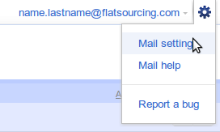
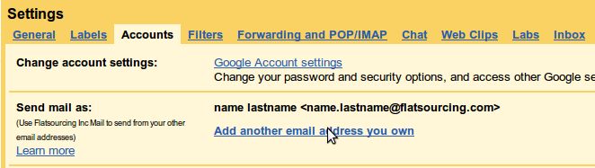
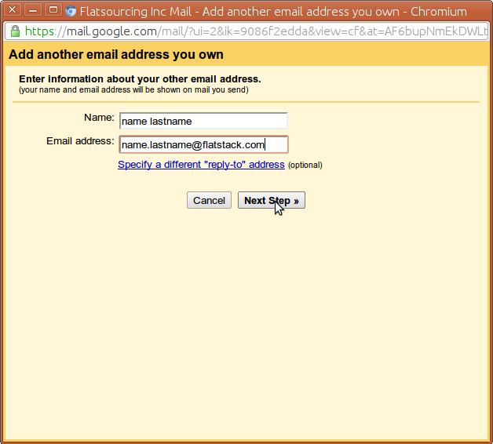
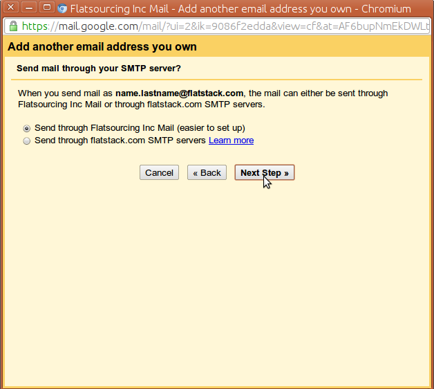
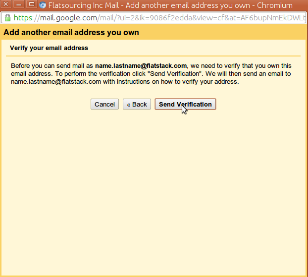
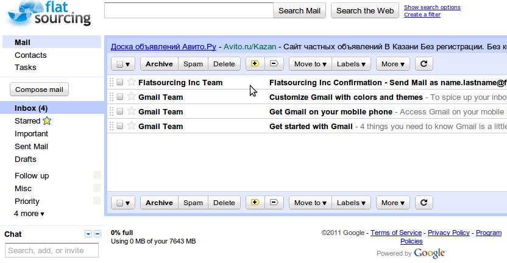
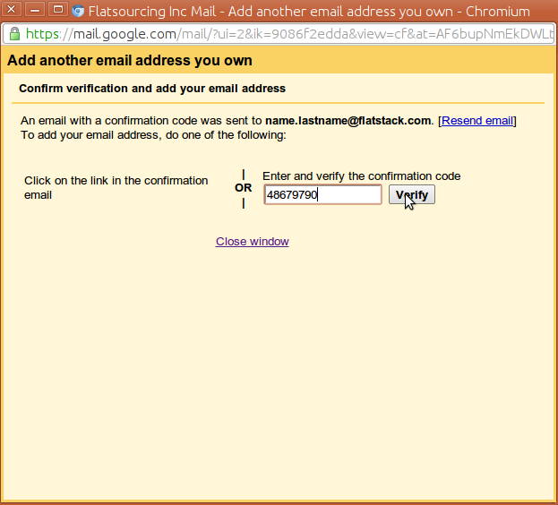
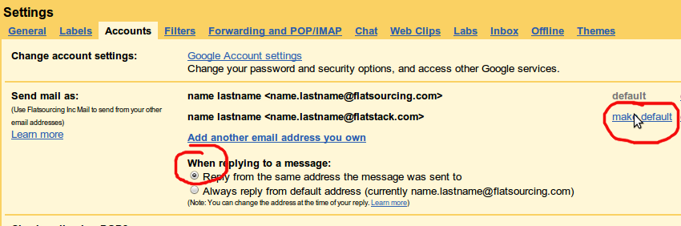

# Настройка почтовых ящиков @flatstack

* Формат адреса: `name.surname@flatstack.com`
* Основной домен `@flatsourcing.com`, ящики на `@flatstack.com` как алиасы для `@flatsourcing.com`
* Проверка почты: http://mail.flatsourcing.com

## Как сделать адрес @flatstack.com основным

### Зайти в настройки почты иконка в верхнем правом углу `Mail settings`
    

### В разделе Accounts нажать на `Add another email address you own`

### Откроется маленькое окно, в нём в поле `Email address` добавить `name.surname@flatstack.com`,
заменив `name.surname` на свои данные.

### `Send mail through your SMTP server?` оставить по умолчанию 

### Скопировать код из письма, (придёт в течении минуты)
    

### Зайти снова в настройки ящика

### Выбрать `Reply from the same address the message was sent to` и выбрать  адрес  `@flatstack.com` по умолчанию

